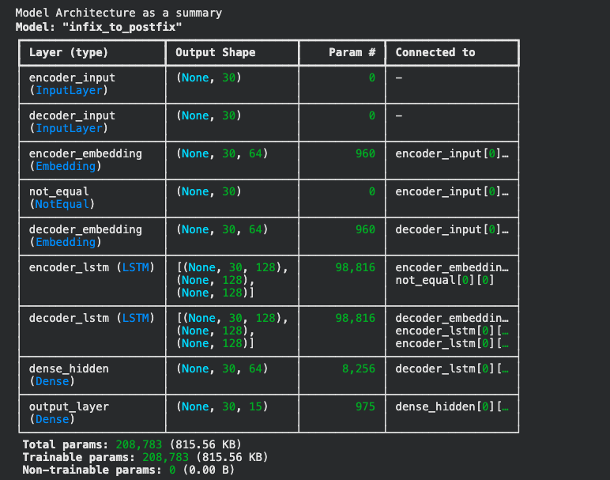
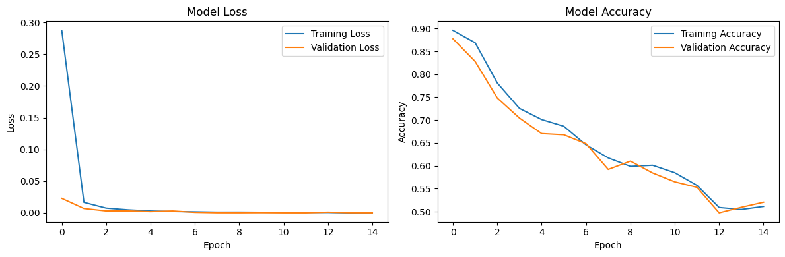
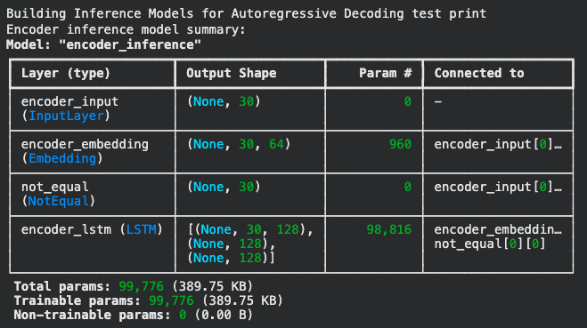
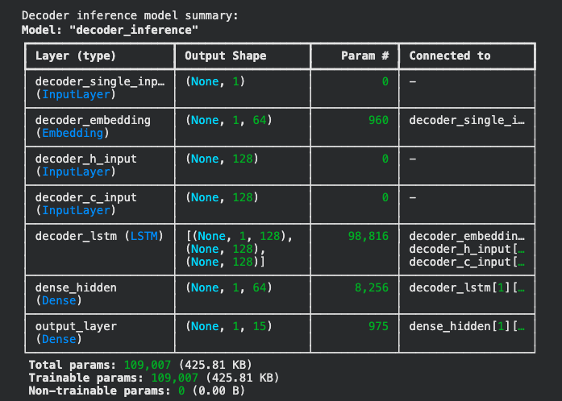

# Infix to Postfix Translation using LSTM Encoder-Decoder

A sequence-to-sequence neural network that translates mathematical **infix expressions** (e.g., `( a + b )`) into **postfix (Reverse Polish) notation** (e.g., `a b +`) using an **LSTM-based encoder-decoder architecture** with true autoregressive decoding.

**Final Score: 1.000 (100% accuracy) with Std: 0.000** across 10 evaluation rounds using proper autoregressive inference.

---

## Table of Contents

- [Overview](#overview)
- [How It Works](#how-it-works)
- [Architecture](#architecture)
- [Dataset](#dataset)
- [Training](#training)
- [Inference: True Autoregressive Decoding](#inference-true-autoregressive-decoding)
- [Results](#results)
- [Quick Start](#quick-start)
- [Vocabulary](#vocabulary)
- [Project Structure](#project-structure)

---

## Overview

Converting infix expressions to postfix is a classic computer science problem typically solved with the **Shunting-Yard algorithm**. This project takes a different approach — it trains a neural network to **learn** this translation directly from data, treating it as a sequence-to-sequence translation task (similar to language translation).

**Key highlights:**
- Encoder-decoder LSTM architecture with only **208,783 trainable parameters**
- Teacher forcing during training, **true autoregressive decoding** during evaluation
- Achieves **perfect 1.000 accuracy** on randomly generated test expressions
- Handles nested expressions up to depth 3 with operators `+`, `-`, `*`, `/`

---

## How It Works

### What is Infix vs Postfix?

| Notation | Example | Description |
|----------|---------|-------------|
| **Infix** | `( a + b )` | Operators between operands (human-readable) |
| **Postfix** | `a b +` | Operators after operands (no parentheses needed) |

More complex example:

```
Infix:   ( ( a - e ) - ( d - b ) )
Postfix: a e - d b - -
```

### The Neural Network Approach

Instead of hand-coding conversion rules, the model:
1. **Reads** the tokenized infix expression through an encoder LSTM
2. **Encodes** it into a fixed-size hidden state vector
3. **Decodes** the postfix expression token-by-token using a decoder LSTM
4. Each output token is predicted based **only** on the encoder state, the previous token, and the decoder's internal state

---

## Architecture

The model uses an **encoder-decoder architecture with LSTM layers**:

```
                    ENCODER                              DECODER
              ┌─────────────────┐                 ┌─────────────────┐
  Infix       │   Embedding     │    [h, c]       │   Embedding     │   Postfix
  Tokens ───> │   (15 x 64)     │ ──────────────> │   (15 x 64)     │ ───> Tokens
              │                 │   hidden state   │                 │
              │   LSTM (128)    │                  │   LSTM (128)    │
              └─────────────────┘                  │                 │
                                                   │   Dense (64)    │
                                                   │   relu          │
                                                   │                 │
                                                   │   Dense (15)    │
                                                   │   softmax       │
                                                   └─────────────────┘
```

### Model Summary



| Layer | Output Shape | Parameters |
|-------|-------------|------------|
| encoder_input (Input) | (None, 30) | 0 |
| decoder_input (Input) | (None, 30) | 0 |
| encoder_embedding (Embedding) | (None, 30, 64) | 960 |
| decoder_embedding (Embedding) | (None, 30, 64) | 960 |
| encoder_lstm (LSTM) | (None, 30, 128) | 98,816 |
| decoder_lstm (LSTM) | (None, 30, 128) | 98,816 |
| dense_hidden (Dense) | (None, 30, 64) | 8,256 |
| output_layer (Dense) | (None, 30, 15) | 975 |

**Total parameters: 208,783** (815.56 KB)

---

## Dataset

Expressions are **randomly generated** with the following properties:

- **Operators:** `+`, `-`, `*`, `/`
- **Identifiers:** `a`, `b`, `c`, `d`, `e`
- **Maximum nesting depth:** 3
- **Maximum sequence length:** 30 tokens

### Dataset Sizes

| Split | Samples |
|-------|---------|
| Training | 100,000 |
| Validation | 10,000 |
| Test | 1,000 |

### Example Data Points

```
Infix:   ( b / d )                              → Postfix: b d /
Infix:   ( e - ( a / d ) )                      → Postfix: e a d / -
Infix:   ( ( a - e ) - ( d - b ) )              → Postfix: a e - d b - -
Infix:   ( ( ( d / b ) + d ) - c )              → Postfix: d b / d + c -
Infix:   ( d * ( ( e / c ) + ( d / c ) ) )      → Postfix: d e c / d c / + *
```

---

## Training

### Configuration

| Parameter | Value |
|-----------|-------|
| Optimizer | Adam |
| Loss | Sparse Categorical Crossentropy |
| Batch Size | 32 |
| Epochs | 15 |
| Learning Rate | 0.001 (with ReduceLROnPlateau) |

### Callbacks

- **EarlyStopping**: Patience of 10 epochs, restores best weights
- **ReduceLROnPlateau**: Reduces LR by factor of 0.5 after 5 epochs of no improvement (min LR: 1e-6)

### Training Method: Teacher Forcing

During training, the decoder receives the **ground truth** previous token at each step (shifted right with an SOS token prepended). This is called **teacher forcing** and helps the model converge faster.

### Training Progress

The model converges within 15 epochs:
- Training accuracy reaches ~50% (token-level during teacher forcing)
- Validation loss decreases steadily
- The key metric is the **autoregressive evaluation score** (see Results), not training accuracy



### Saved Model Formats

The trained model is saved in three formats:
- `modelx.keras` — Full Keras model
- `modelx.weights.h5` — Weights only
- `modelx_ckpt` — TensorFlow SavedModel format

Pretrained weights are also available via Google Drive for quick loading without retraining.

---

## Inference: True Autoregressive Decoding

### Why Not Use the Training Model Directly?

During training, the decoder sees the **full target sequence** at once (teacher forcing). Using `model.predict()` directly for evaluation would allow the decoder to "cheat" by accessing future tokens — this **violates true autoregressive decoding**.

### The Solution: Separate Inference Models

Two separate models are built from the trained model's weights:

**1. Encoder Inference Model** (99,776 params)
- Input: Full infix token sequence
- Output: Hidden state `[h, c]` (128-dim each)



**2. Decoder Inference Model** (109,007 params)
- Input: Single token + previous states `[h, c]`
- Output: Next token probabilities + updated states `[h, c]`



### Step-by-Step Decoding Process

```
1. Encode the full infix expression → get initial [h, c]
2. Start with SOS token
3. Loop:
   a. Feed current token + [h, c] into decoder
   b. Get predicted next token (greedy argmax)
   c. Update [h, c] with new decoder states
   d. If predicted token is EOS → stop
   e. Otherwise → feed predicted token back as input
4. Return the decoded postfix sequence
```

This ensures the model generates tokens **strictly one at a time**, with no lookahead — exactly how a real-time parser would operate.

---

## Results

### Autoregressive Evaluation

Tested with **true autoregressive decoding** over 10 rounds of 20 randomly generated expressions each:

```
Testing with Proper Autoregressive Decoding
Round 1/10
Round 2/10
...
Round 10/10
Score: 1.000, Std: 0.000
```

**The model achieves perfect 100% accuracy** on converting infix expressions to postfix notation using proper step-by-step autoregressive inference.

---

## Quick Start

### Option 1: Run in Google Colab (Recommended)

Click the badge below to open directly in Colab:

[](https://colab.research.google.com/github/ddsyasas/Infix-to-Postfix-Translation-LSTM/blob/master/Infix-to-postfix-translation-model-Yasas.ipynb)

Then run all cells with **Runtime > Run all**.

### Option 2: Run Locally

```bash
# Clone the repository
git clone https://github.com/ddsyasas/Infix-to-Postfix-Translation-LSTM.git
cd Infix-to-Postfix-Translation-LSTM

# Install dependencies
pip install tensorflow numpy matplotlib

# Open the notebook
jupyter notebook Infix-to-postfix-translation-model-Yasas.ipynb
```

### Using Pretrained Weights

The notebook includes a cell that downloads pretrained weights from Google Drive, so you can skip the training step and go directly to evaluation:

```python
# This is already in the notebook — just run the cell
!pip install -q gdown
!gdown https://drive.google.com/uc?id=1QBp1wlIrFyWb8zPEPQIdT4SWL3kkop3v -O Infix-to-postfix-translation-model-Yasas1.weights.h5
model.load_weights("Infix-to-postfix-translation-model-Yasas1.weights.h5")
```

---

## Vocabulary

The model uses a vocabulary of 15 tokens:

| Token | ID | Type |
|-------|-----|------|
| PAD | 0 | Special (padding) |
| SOS | 1 | Special (start of sequence) |
| EOS | 2 | Special (end of sequence) |
| ( | 3 | Symbol |
| ) | 4 | Symbol |
| + | 5 | Operator |
| - | 6 | Operator |
| * | 7 | Operator |
| / | 8 | Operator |
| a | 9 | Identifier |
| b | 10 | Identifier |
| c | 11 | Identifier |
| d | 12 | Identifier |
| e | 13 | Identifier |
| JUNK | 14 | Special (unused) |

---

## Project Structure

```
Infix-to-Postfix-Translation-LSTM/
├── Infix-to-postfix-translation-model-Yasas.ipynb   # Main notebook (complete project)
├── images/
│   ├── model_architecture.png                        # Training model summary
│   ├── training_history.png                          # Loss and accuracy curves
│   ├── encoder_inference.png                         # Encoder inference model summary
│   └── decoder_inference.png                         # Decoder inference model summary
├── .gitignore
└── README.md
```

---

## Dependencies

- Python 3.x
- TensorFlow >= 2.18
- NumPy
- Matplotlib

---

## Author

**Sajana Yasas** ([ddsyasas](https://github.com/ddsyasas))

---

## License

This project is licensed under the [MIT License](LICENSE).
